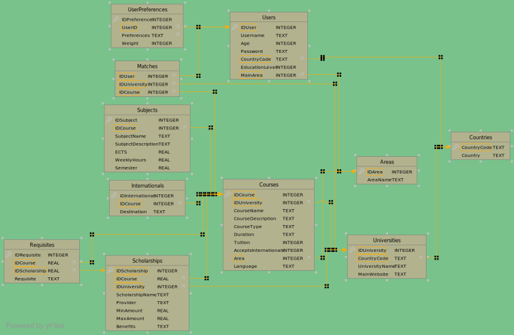

# UniMatch

This README.md template is designed to provide a clear and structured guide for documenting your chatbot project. It outlines the essential sections that should be included in your repository to ensure that anyone reviewing or contributing to the project can easily understand its functionality, setup process, and testing methodology. By following this template, you'll ensure that your project is well-documented, making it easier for team members and future contributors to maintain and extend the chatbot.

## 1. Project Overview

- **Company Name**: UniMatch
- **Group 10**:
   - Dino Meng - 20241265
   - Lourenço Passeiro - 20221838
   - Miguel Marques - 20221839
   - Peter Lekszycki - 20221840
   - Tomás Gonçalves - 20221894
- **Description**:  
  Provide a concise overview of the company and the chatbot's purpose. Outline its core functionality and the intended use cases it addresses, including how it interacts with users, the types of queries it handles, and its overall objective.

---

## 2. How to Test the Chatbot - TODO

### 2.1 Prerequisites

- **Python Version**: Python 3.12.7
- **Dependencies**:  
  List all the required libraries and frameworks.
- **Environment Setup**:  
  Instructions for setting up the environment, such as creating a virtual environment or conda environment.

### 2.2 How to Run the Chatbot

Provide a clear, step-by-step guide on how to launch and interact with the chatbot. Include any necessary commands, parameters, or configurations. Groups should provide information of an existing user so i can test the chatbot using information of that user, i will also test the registration process.

## 3. Database Schema - TODO

### 3.1 Database Overview and Schema Diagram

Provide an overview of the database used by the chatbot system. Include a diagram of the database schema to visually represent the structure of tables, their relationships, and data flow. (with image)

### 3.2 Table Descriptions - TODO

Describe each table in the database schema, including its columns and their purpose.

---

## 4. User Intentions - TODO

### 4.1 Implemented Intentions

List and briefly describe the user intentions that the chatbot is designed to handle. For example:

- **Product Information**: User requests details about a specific product or product category.
- **Order Status**: User queries the status of an existing order based on an order ID.
- **Create Order**: User intends to create a new order, and the chatbot processes the order request.

### 4.2 How to Test Each Intention - TODO (Dino)

For each intention, provide 3 examples of test messages that users can use to verify the chatbot's functionality. Include both typical and edge-case inputs to ensure the chatbot handles various scenarios.

#### Product Information

**Test Messages:**

1. "Tell me about the latest phone models."
2. "Give me more details about the tablet in your store."
3. "What products do you offer in the electronics section?"

**Expected Behavior:**  
The chatbot should retrieve and present information about the specific product or category the user is inquiring about.

---

## 5. Intention Router - DONE

### 5.1 Intention Router Implementation

- **Message Generation**:  
  Describe how you generated messages for each user intention. Did you create the messages manually, use synthetic data, or leverage a dataset? Specify the method used and tools/scripts for generating the data.  
  Where are the generated messages stored (e.g., in a file, database, or another format)?

For each intention we synthetically generated 50 messages, through LLMs (see the script `UniMatch/chatbot/router/generate_intentions.ipynb`), with an additional of 25 irrelevant messages. Moreover, for the "Manage Personal Information" intention we created other fifty synthetic intentions, as by testing we saw that it was the most misclassified.

### 5.2 Semantic Router Training
- **Encoder Type**
We had mainly two choices for our router, regarding the encoder. Either we could have used an encoder from HuggingFace, or from OpenAI. To determine which one was the best for our intentions, we decided to train two baseline semantic routers and evaluated their accuracy scores accordingly; the one which showed the least signs of overfitting was picked for hyperparamter tuning.

Output: OpenAI's encoder gave us an accuracy of 0.9855, while HuggingFace's encoder had a 0.9493 accuracy. OpenAI's encoder was chosen as it had the best performance, even if it takes longer to train.

- **Other Hyperparameters: Aggregation method and Top K**
To decide on the aggregation method, we decided to test each one of them and chose the one with the best result, as done similarly with encoders.

**Results** (tabular format):
| Aggregate | Train | Validate |
| --------- | ----- | -------- |
| mean      | 0.93  | 0.98     |
| max       | 0.93  | 0.98     |
| sum       | 0.94  | 0.98     |

We choose `aggregation=sum` as it had the best train and evaluation score.

Then to decide the `top_k` parameter, we decided to do the same as above with the following candidates of `top_k`: k=1 (low), k=5 (average), k=50 (high).

**Results**: No variations in scores, meaning that in our case `top_k` is not influential. We chose `top_k=5` as it represented a sort of mid point between the possible decisions.

**Note**: A better alternative to this approach would have to use a GridSearchCV-similar approach; however as this is deemed to be too computationally expensive, we opted for an "evolutionary" approach.

For further details about the evaluation see the notebook at `UniMatch/chatbot/router/train_evaluate_router.ipynb`.

---

## 6. Intention Router Accuracy Testing Results - DONE

### Methodology

1. **Message Creation**:

   - Generate at least 50 messages per intention, totaling 400 messages. These can be either synthetic or human-generated.
   - Additionally, generate at least 25 small-talk messages related to your company and 25 off-topic messages unrelated to the company, labeled as "None."

2. **Data Splitting**:

   - Split the dataset into training and testing sets (90/10), ensuring a balanced distribution of each intention across both sets.

3. **Training the Semantic Router**:

   - Use the training split to train the semantic router. Report the accuracy on both the training and testing splits.

4. **Post-Processing with LLM**:

   - If applicable, apply post-processing using an LLM to improve the accuracy of the router. Report accuracy on both the training and testing splits after post-processing.

5. **Reporting Results**:

   - Report the accuracy for each intention, as well as the overall accuracy. Accuracy should be calculated as the percentage of correct responses out of the total inputs for each intention.

### Results

As we fine-tuned our router classifier, we evaluated it with the test data:

| Intentions                             | Total | Misclassified | Accuracy |
| -------------------------------------- | ----- | ------------- | -------- |
| Manage Personal Information            | 10    | 0             | 100%     |
| Search Scholarships and Internationals | 6     | 0             | 100%     |
| Search Universities                    | 6     | 1             | 83%      |
| Matchmaking                            | 5     | 0             | 100%     |
| Query Matches                          | 5     | 0             | 100%     |
| Leverage RAG (User-Uploaded Files)     | 5     | 0             | 100%     |
| Company Information                    | 6     | 0             | 100%     |
| None                                   | 3     | 2             | 33%      |
| All                                    | 46    | 3             | 85%      |